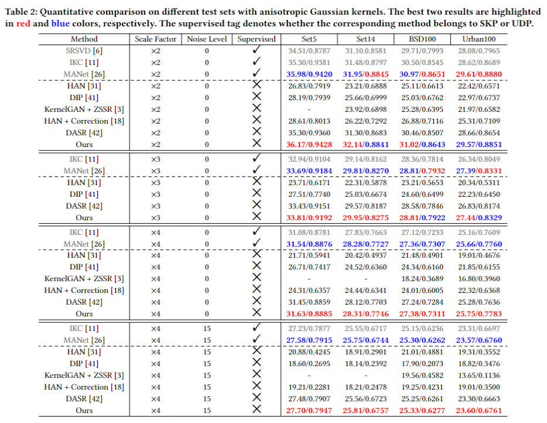

# Joint Learning Content and Degradation Aware Embedding for Blind Super-Resolution
**[[Arxiv]](https://arxiv.org/abs/2208.13436)**
## News
:bell: We are happy to announce that CDSR was accepted at **ACM MM22**. :bell:

## Introduction
Based on the designs of degradation extraction, existing blind SR approaches can be divided into two groups:
1. Supervised Kernel Prediction (SKP) methods leverage explicit or implicit ways to predict blur kernels, and then employ the kernel stretching strategy to provide the degradation information for non-blind SR networks. 
2. Unsupervised Degradation Prediction (UDP): Instead of requiring supervision from the ground-truth kernel label, UDP leverages the degradation embedding which can naturally avoid the drawback of SKP.

As the most representative approach, [DASR](https://github.com/The-Learning-And-Vision-Atelier-LAVA/DASR) investigates the degradation representation in an unsupervised manner through contrastive learning.
Although DASR has outperformed some SKP methods within the easy degradation, there is still a gap between DASR and the latest SKP in more complex scenarios. 

## Motivation
### The Higher Degradation Accuracy the Better?
We firstly investigate the key point on: What kind of degradation embedding is really needed for SR networks? Surprisingly, we observed that using a degradation-oriented embedding will fail to improve the network performance or even end up with poor results.

Since the content information can serve as the cue for the SR network, we derive that content-aware degradation helps address the interference from the domain gap between degradation and content spaces. 
The previous methods which only employ a small receptive field or naive encoder may be stumbled by the inconsistency between the above two spaces because these embeddings do not make full use of the content information.

## Contribution
- We first analyze the relation between content information and degradation embedding. Based on this, we proposed a lightweight patch-based encoder (LPE) to extract content-aware degradation embedding features.
- To adaptively fuse the predicted embedding into the SR network, we present a Domain Query Attention based module (DQA) to adaptively fuse the predicted content and degradation aware embedding into the SR network.
- We extend the idea of PCA and introduce a Codebook-based Space Compress module (CSC) to limit the basis of feature space.

## CDSR




## For training and testing
### 1. Prepare training data 

1.1 Download the [DIV2K](https://data.vision.ee.ethz.ch/cvl/DIV2K/)  dataset and the [Flickr2K](http://cv.snu.ac.kr/research/EDSR/Flickr2K.tar) dataset.

1.2 Combine the HR images from these two datasets in `your_data_path/DF2K/HR` to build the DF2K dataset. 
refer to [DASR](https://github.com/The-Learning-And-Vision-Atelier-LAVA/DASR)

For training using `main_patchdasr.py`:

```bash
CUDA_VISIBLE_DEVICES=0 python3 main.py --dir_data=/root/DF2k/HR  --model=CDSR --scale=2 --blur_type=aniso_gaussian  --noise=0  --sig_min=0.35   --sig_max=5  --batch_size=32   --save=cdsr  --epochs_encoder=-1 --n_GPUs=2 --freeze_epoch 600 --sv_mode 0
```

For testing using `main_patchdasr.py`:

```bash
CUDA_VISIBLE_DEVICES=0 python3 test.py --dir_data=/root/DF2k/HR  --model=CDSR --scale=2 --blur_type=aniso_gaussian  --noise=0 --pre_train experiment/cdsr_x2_bicubic_aniso/model/model_492_psnr_36.17.pt --sv_mode 0 --n_GPUs=2
```
"Your/path/to/SRTestset"  contains 
    - Set5_x2(x3;x4) 
    - Set14_x2(x3;x4) 
    - B100_x2(x3;x4) 
    - Urban100_x2(x3;x4)

We also provide the ckpts to reproduce our results in our paper. Put them in the dir of `./experiments`.
[BaiduYunPan](https://pan.baidu.com/s/1h9s7e3bzzUb-BwCvlEpZQA )  code: vywq 

## Citation
```
@article{zhou2022joint,
  title={Joint Learning Content and Degradation Aware Feature for Blind Super-Resolution},
  author={Zhou, Yifeng and Lin, Chuming and Luo, Donghao and Liu, Yong and Tai, Ying and Wang, Chengjie and Chen, Mingang},
  journal={arXiv preprint arXiv:2208.13436},
  year={2022}
}
```

## Acknowledgements
This code is built on [EDSR (PyTorch)](https://github.com/thstkdgus35/EDSR-PyTorch), [IKC](https://github.com/yuanjunchai/IKC), [MoCo](https://github.com/facebookresearch/moco) and [DASR](https://github.com/The-Learning-And-Vision-Atelier-LAVA/DASR).  
We thank the authors for sharing the codes.